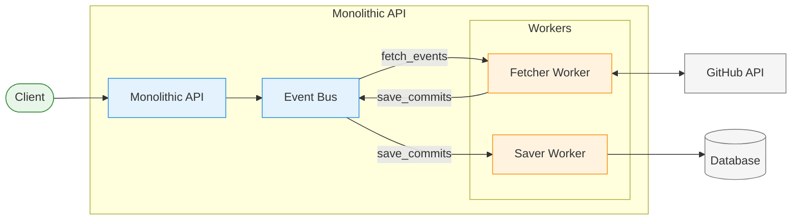
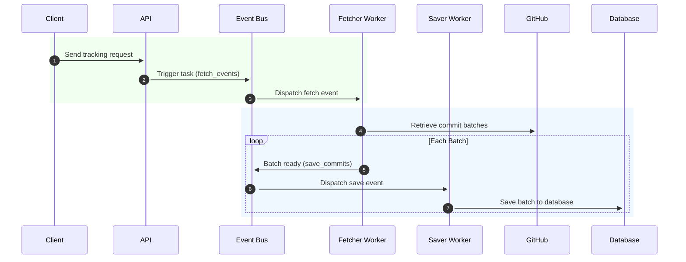

# Git Monitor API Documentation

## Introduction

Git Monitor is a RESTful API service designed to track GitHub repositories and monitor their commits effectively. It enables asynchronous fetching and processing of commit data using background worker services, providing valuable insights and statistics about repository activities. Built on a Domain-Driven Design (DDD) architecture, Git Monitor maintains clear separation of concerns between its layers, ensuring a scalable and maintainable codebase.

### Key Features

- **Track GitHub Repositories** - Add repositories to continuously monitor for new commits.
- **View Tracked Repositories** - Retrieve a list of repositories you are monitoring, along with their tracking settings.
- **Reset Repository Data** - Clear all collected data for a repository and reset tracking.
- **Commit Insights and Statistics** - Access detailed commit history and identify top contributors based on commit frequency.
- **Background Task Management**
  - Initiate tasks manually or schedule automatic fetching and processing of commit data.
  - Monitor the status and progress of background tasks.

### Technical Overview

- **Asynchronous Operations:** Background workers handle commit data fetching efficiently, minimizing response times and ensuring robust performance.
- **Data Storage:** Utilizes SQLite as the primary database, providing lightweight and reliable data management.
- **Architecture:** Follows Domain-Driven Design principles, clearly separating concerns across domain, application, infrastructure, and presentation layers.

---

## Table of Contents

1. [Introduction](#introduction)
2. [Quick Start Guide](#quick-start-guide)
3. [Folder Structure](#folder-structure)
4. [Schema Design](#schema-design)
5. [Architecture](#architecture)
6. [API Endpoints](#api-endpoints)
7. [API Errors](#api-errors)
8. [Makefile Commands](#makefile-commands)
9. [Optional Configuration Parameters](#optional-configuration-parameters)

---

## Quick Start Guide

### Prerequisites

- [Go](https://golang.org/) installed on your machine.
- [Docker](https://www.docker.com/) installed and running on your machine.

### Installation & Running

1. **Clone the Repository:**

   ```sh
   git clone https://github.com/yourusername/git-monitor.git
   cd git-monitor
   ```

2. **Build and Run the Application:**
   Use the provided Makefile commands:

- **Build and run:**
  ```sh
  make build-run
  ```
- **Or, run locally with:**
  ```sh
  make run
  ```

3. **Database Setup:**

- **Run migrations:**
  (Optional - has attached pre migrated db file)
  ```sh
  make migrate
  ```
- **Reset the database (deletes the current database file and reapplies migrations):**
  ```sh
  make reset-db
  ```

4. **Testing:** Run tests with:
   ```sh
   make test
   ```

### Required Environment Variables

Create a `.env` file in the project root containing:

```
GITHUB_TOKEN=your_github_token_here
```

For a complete list of optional config parameters see [optional config](#optional-configuration-parameters)

---

## Postman collection

A Postman collection is provided in the root of the project as .postman_collection.json. You can use this collection to quickly explore and test the API endpoints.

To use the Postman collection:

Open Postman.
Click on "Import" and select the .postman_collection.json file from the project root.
Explore the endpoints included in the collection and run sample requests.

---

## Folder Structure

```
├── cmd
│   ├── app
│   └── migration_runner
├── data
│   └── app.db
├── config
├── migrations
├── internal
│   ├── db
│   │    ├── store
│   │    └── db.go
│   ├── domain
│   │   ├── models
│   │   ├── services
│   │   ├── events
│   │   └── errors
│   ├── http
│   │   ├── server
│   │   ├── handlers
│   │   ├── models
│   │   ├── errors
│   │   └── utils
│   ├── scheduler
│   └── worker
│       ├── fetcher
│       └── saver
├── pkg
│   ├── logger
│   ├── migrator
│   ├── githubclient
│   ├── github
│   └── utils
├── .gitignore
├── .postman_collection.json
├── go.mod
├── go.sum
├── makefile
└── README.md
```

- **cmd/**: Contains the entry points for the application.
  - **app/**: Contains the main application (`main.go`).
  - **migration_runner/**: Contains the migration runner (`main.go`).
- **data/**: Contains database files, such as `app.db`.
- **config/**: Configuration files and utilities.
- **internal/**: Contains internal application logic and modules.
  - **domain/**: Domain logic including models, errors, and domain-specific functions.
    - **models/**: Domain entities and models.
    - **services/**: Business logic or Entity use cases.
    - **events/**: Domain events for fetching and saving commits.
    - **errors/**: Domain errors.
  - **http/**: HTTP related code including the server, handler, models and http errors.
  - **scheduler/**: Handles scheduled trigger for tasks based on specified interval.
  - **worker/**: Background worker services for fetching and saving commits data.
- **migrations/**: SQL migration files for setting up and tearing down database schemas.
- **pkg/**: External or reusable packages.
  - **logger/**: Logging utilities.
  - **migrator/**: Migration management utilities.
  - **github/**: github service to handle github api requests.
  - **eventbus/**: Pub sub event bus implementation using Go's internals.

## Schema Design

### Repositories

| Field                     | Type   | Description                                           | Sample Value                                 |
| ------------------------- | ------ | ----------------------------------------------------- | -------------------------------------------- |
| `ID`                      | string | Unique identifier for the repository                  | `repo-893fefea52554d17a77d5e05152bb5d1`      |
| `RepoID`                  | string | GitHub repository ID                                  | `1234567`                                    |
| `Name`                    | string | Repository name                                       | `git-monitor`                                |
| `Owner`                   | string | Repository owner's login                              | `victor-nach`                                |
| `Description`             | string | Description of the repository                         | "Monitors Git commits"                       |
| `URL`                     | string | URL of the GitHub repository                          | `https://github.com/victor-nach/git-monitor` |
| `Language`                | string | Primary programming language                          | `Go`                                         |
| `ForksCount`              | int    | Number of forks                                       | `5`                                          |
| `StarsCount`              | int    | Number of stars                                       | `10`                                         |
| `OpenIssues`              | int    | Number of open issues                                 | `2`                                          |
| `WatchersCount`           | int    | Number of watchers                                    | `8`                                          |
| `IsActive`                | bool   | Flag indicating if the repository is actively tracked | `true`                                       |
| `CommitTrackingStartTime` | time   | Start time for commit tracking                        | `2021-01-01T00:00:00Z`                       |
| `LastFetchedAt`           | time   | Last time commits were fetched                        | `2021-02-01T00:00:00Z`                       |
| `LastFetchedCommitTime`   | time   | Time stamp of the last fetched commit                 | `2021-02-01T00:00:00Z`                       |
| `RepoCreatedAt`           | time   | Date the repository was created                       | `2020-12-01T00:00:00Z`                       |
| `RepoUpdatedAt`           | time   | Date the repository was last updated                  | `2021-03-01T00:00:00Z`                       |
| `CreatedAt`               | time   | Timestamp when the repository was added to tracking   | `2021-03-15T00:00:00Z`                       |
| `UpdatedAt`               | time   | Timestamp when the repository record was last updated | `null`                                       |

### Commits

| Field          | Type   | Description                                | Sample Value                                                 |
| -------------- | ------ | ------------------------------------------ | ------------------------------------------------------------ |
| `ID`           | string | Unique commit identifier                   | `commit-893fefea52554d17a77d5e05152bb5d1`                    |
| `SHA`          | string | Git commit SHA (Unique)                    | `a1b2c3d4`                                                   |
| `RepositoryID` | string | Foreign key linking to the repository      | `repo-893fefea52554d17a77d5e05152bb5d1`                      |
| `RepoName`     | string | Name of the repository                     | `git-monitor`                                                |
| `Message`      | string | Commit message                             | "Fix bug in API"                                             |
| `URL`          | string | URL to the commit on GitHub                | `https://github.com/victor-nach/git-monitor/commit/a1b2c3d4` |
| `Author`       | string | Name of the commit author                  | `John Doe`                                                   |
| `AuthorEmail`  | string | Email address of the commit author         | `john@example.com`                                           |
| `Date`         | time   | Date of the commit                         | `2021-03-14T12:00:00Z`                                       |
| `CreatedAt`    | time   | Timestamp when the commit was recorded     | `2021-03-14T12:05:00Z`                                       |
| `UpdatedAt`    | time   | Timestamp when the commit was last updated | `null`                                                       |

### Tasks

| Field          | Type   | Description                                               | Sample Value                            |
| -------------- | ------ | --------------------------------------------------------- | --------------------------------------- |
| `ID`           | string | Unique identifier for a scheduled task                    | `task-123456789`                        |
| `RepositoryID` | string | Foreign key linking to the repository                     | `repo-893fefea52554d17a77d5e05152bb5d1` |
| `RepoName`     | string | Name of the repository                                    | `git-monitor`                           |
| `Status`       | string | Current status of the task (e.g., in-progress, completed) | `completed`                             |
| `CreatedAt`    | time   | Timestamp when the task was created                       | `2021-03-14T12:10:00Z`                  |
| `CompletedAt`  | time   | Timestamp when the task was completed                     | `2021-03-14T12:10:00Z`                  |

---

## Architecture

- **System Architecture Design**


- **Sequence diagram for fetching commits in batches**


- ### Description

1. **Client Request**: The client initiates a request to the API to start tracking commits for a repository.
2. **API Task Trigger**: The API creates a task and sends an event to the `fetch_events` topic on the Event Bus.
3. **Event Dispatch**: The Event Bus forwards the event to the Fetcher Worker.
4. **Fetch Commit Batches**: The Fetcher Worker retrieves commits from GitHub in batches.
5. **Batch Processing**: For each batch of commits fetched:
   - The Fetcher Worker sends the batch to the `save_commits` topic on the Event Bus.
   - The Event Bus triggers the Saver Worker.
   - The Saver Worker saves the batch of commits into the database.
6. **Completion**: Steps 5 is repeated until all batches have been processed and saved successfully.

---

## API Endpoints

### Repositories

### 1. Add a new repository to track.

- **POST `api/v1/repos/:owner/:repo?since={timestamp}`**

  - Adds a new repository to the tracked list based on a specified since date for the commits
  - Also triggers one time async task to fetch commits for the specified repo

- **Request Query Parameters:**

  - `since` - timestamp e.g `2025-03-16T00:00:00Z` (optional)

- **Response**
  ```
  {
      "status": "success",
      "message": "Repository added successfully",
      "data": {
          "task_id": "task-5baf6b88a7444b8982a407d4b984d076",
          "repository": {
              "id": "repo-893fefea52554d17a77d5e05152bb5d1",
              "repo_id": 120360765,
              "name": "chromium",
              "owner": "chromium",
              "description": "The official GitHub mirror of the Chromium source",
              "url": "https://github.com/chromium/chromium",
              "language": "C++",
              "forks_count": 7420,
              "stars_count": 20147,
              "open_issues": 120,
              "watchers_count": 20147,
              "is_synced_to_start_time": false,
              "is_active": true,
              "commit_tracking_start_time": "2025-03-16T00:00:00Z",
              "last_fetched_at": null,
              "last_fetched_commit_time": null,
              "repo_created_at": "2018-02-05T20:55:32Z",
              "repo_updated_at": "2025-03-17T15:50:27Z",
              "created_at": "2025-03-17T16:52:38.6441654+01:00",
              "updated_at": null
          }
      }
  }
  ```

### 2. Retrieve all tracked repositories.

- **GET `api/v1/repos`**

- **Response**
  ```
  {
  "status": "success",
  "message": "Tracked repositories listed successfully",
  "data": [
      {
          "id": "repo-893fefea52554d17a77d5e05152bb5d1",
          "repo_id": 120360765,
          "name": "chromium",
          "owner": "chromium",
          "description": "The official GitHub mirror of the Chromium source",
          "url": "https://github.com/chromium/chromium",
          "language": "C++",
          "forks_count": 7420,
          "stars_count": 20147,
          "open_issues": 120,
          "watchers_count": 20147,
          "is_synced_to_start_time": false,
          "is_active": true,
          "commit_tracking_start_time": "2025-03-12T00:00:00Z",
          "last_fetched_at": "2025-03-17T16:55:21.1334248+01:00",
          "last_fetched_commit_time": "2025-03-17T15:50:06Z",
          "repo_created_at": "2018-02-05T20:55:32Z",
          "repo_updated_at": "2025-03-17T15:50:27Z",
          "created_at": "2025-03-17T16:52:38.6441654+01:00",
          "updated_at": "2025-03-17T16:55:21.1334248+01:00"
      }
    ]
  }
  ```

### 3. Reset a repository's tracked data.

- **POST `api/v1/repos/:owner/:repo/reset?since={timestamp} `**

- **Response**
  ```
  {
    "status": "success",
    "message":  "Repository reset successfully",
     "data": {
          "task_id": "task-5baf6b88a7444b8982a407d4b984d076"
     }
  }
  ```

### 4. Update repository active tracking status.

- **PATCH `api/v1/repos/:owner/:repo/status?status={active|inactive}`**

- **Response**
  ```
  {
    "status": "success",
    "message": "Repository status updated successfully",
     "data": {
          "task_id": "task-5baf6b88a7444b8982a407d4b984d076"
     }
  }
  ```

### 5. Manually trigger data fetching of the latest commits for a tracked repository.

- **POST `api/v1/repos/:owner/:repo/trigger`**

- **Response**
  ```
  {
    "status": "success",
    "message": "Task triggered successfully",
     "data": {
          "task_id": "task-5baf6b88a7444b8982a407d4b984d076"
     }
  }
  ```

### Repositories

### 6.List commits of a tracked repository

- **POST `api/v1/repos/:owner/:repo/commits `**
- **Request Query Parameters:**

  - `limit` - int - limit per page
  - cursor - cursor parameter to retrieve next cursor

- **Response**
  ```
  {
  "status": "success",
  "message": "Commits listed successfully",
  "pagination": {
      "next_cursor": "2025-03-16T23:16:09Z"
      "prev_cursor": "2025-03-16T23:16:09Z"
      "total_count": "2025-03-16T23:16:09Z"
  },
  "data": [
      {
          "id": "commit-9c73f925da0e4161ad5319c61d67a639",
          "sha": "5e501d83ae51def3d80334ceae21d3d0aee68972",
          "repository_id": "repo-3628de94f055443a99150a1dacd254f3",
          "repo_name": "chromium",
          "repo_owner": "chromium",
          "message": "Roll clank/internal/apps",
          "author": "chromium-internal-autoroll",
          "author_email": "chromium-internal-autoroll@skia-corp.google.com.iam.gserviceaccount.com",
          "date": "2025-03-17T00:20:14Z",
          "url": "https://github.com/chromium/chromium/commit/5e501d83ae51def3d80334ceae21d3d0aee68975",
          "created_at": "2025-03-17T01:35:46.0368056+01:00",
          "updated_at": "2025-03-17T01:35:46.1126673+01:00"
      }
    ]
  }
  ```

### 7. Get top commit authors for a repository.

- **POST `api/v1/repos/:owner/:repo/trigger`**

  - `limit` - int - count for top n commit authors

- **Response**
  ```
   {
    "status": "success",
    "message": "Top commit authors retrieved successfully",
    "data": [
      {
          "author": "chromium-autoroll",
          "commits": 126
      },
      {
          "author": "chromium-internal-autoroll",
          "commits": 36
      }
    ]
  }
  ```

---

## API Errors

### Domain Errors

| Error Code                  | HTTP Status                 | Description                                                                    |
| --------------------------- | --------------------------- | ------------------------------------------------------------------------------ |
| `InvalidInput`              | `400 Bad Request`           | Invalid input provided.                                                        |
| `RepositoryNotFound`        | `404 Not Found`             | The specified repository doesn't exist. Verify the owner and repository names. |
| `TrackedRepositoryNotFound` | `404 Not Found`             | The repository isn't in your tracked list.                                     |
| `DuplicateRepository`       | `409 Conflict`              | The repository already exists in the tracked list.                             |
| `Unauthorized`              | `401 Unauthorized`          | Unauthorized access.                                                           |
| `InvalidResponse`           | `502 Bad Gateway`           | Invalid response from GitHub API.                                              |
| `InternalServer`            | `500 Internal Server Error` | Internal server error.                                                         |
| `ErrTaskNotFound`           | `404 Not Found`             | Task/job not found.                                                            |

### HTTP Errors

| Error Code                | HTTP Status                 | Description                                         |
| ------------------------- | --------------------------- | --------------------------------------------------- |
| `InvalidPaginationParams` | `400 Bad Request`           | Invalid pagination parameters provided.             |
| `InputValidation`         | `400 Bad Request`           | Input validation failed.                            |
| `InvalidTimeFormat`       | `400 Bad Request`           | Invalid time format provided for request parameter. |
| `ErrMissingRepoInfo`      | `400 Bad Request`           | Missing required path parameters: owner and repo.   |
| `InvalidTaskID`           | `400 Bad Request`           | Missing or invalid task ID in request.              |
| `InvalidStatus`           | `400 Bad Request`           | Invalid repository status provided.                 |
| `RepoInfoNotFound`        | `404 Not Found`             | Repository information not found in context.        |
| `InternalServer`          | `500 Internal Server Error` | Internal server error, please try again later.      |

---

## Optional Configuration Parameters

| Variable                    | Default Value | Description                                                       |
| --------------------------- | ------------- | ----------------------------------------------------------------- |
| `PORT`                      | `8080`        | Port on which the API server listens.                             |
| `APP_ENV`                   | `development` | Application environment (`development`, `staging`, `production`). |
| `GITHUB_TOKEN`              | _(required)_  | GitHub token used for authentication with GitHub API.             |
| `DB_FILE_NAME`              | `app.db`      | Filename for the SQLite database.                                 |
| `QUEUE_BUFFER_SIZE`         | `100`         | Size of the buffered channel queue.                               |
| `WORKER_SIZE`               | `2`           | Number of concurrent workers processing tasks.                    |
| `GITHUB_BATCH_SIZE`         | `100`         | Number of commits fetched per batch from GitHub API.              |
| `SCHEDULE_INTERVAL_MINUTES` | `60m`         | Interval for scheduling recurring fetch tasks.                    |
